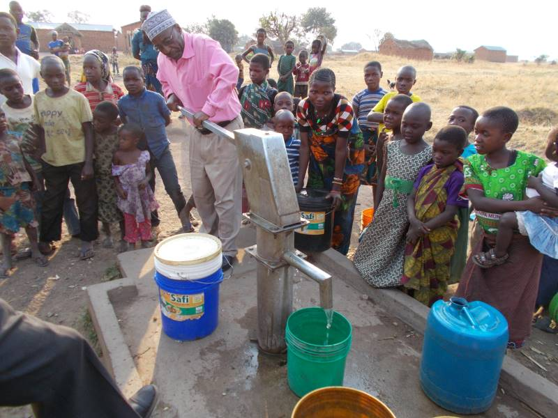

# Tanzania Water Wells Project
**Author**: [Morgan Nash](mailto:morganmichellenash@gmail.com)

[Photo from Tanzania Rural Revival](https://tanzaniaruralrevival.org.uk/2017-visit/) 

# Overview
This project aims to build classification models to predict the functionality of water wells in Tanzania to help Non-Government Organizations determine which wells they need to repair as well as give insite to factors that most strongly affect water pump functionality.

# Business Understanding 
Tanzania is facing a water crisis due to many factors, some of them include climate change (droughts), higher demand for water due to increased population, and infrastructure and management issues (lack of funding for investment in proper infrastructure). Tanzania's water supply sytem has frequent water pump breakdowns which lead to frequent disruptions in water supply. Not having access to clean water means significant time and energy is spent on travelling to collect water, taking people away from work leading to subsequent socio-economic losses. Access to safe water and sanitation improves health and helps families protect themselves from illness and disease. The Government of Tanzania as well as certain Non-Government Organizations aim to mitigate the water crisis by strategically increasing investment in the maintenance and functionality of water wells across the country.
## Stakeholders:
* Non Government Organizations (NGOs) focused on helping Tanzania gain clean water access
* Government of Tanzania
# Objective 
This project aims to:
* Gain deeper understanding of the factors that affect the functionality of a pump
* Build classification models using the features of the dataset
* Test and evaluate the models
* Address conclusions, recommendations, and limitations that the stakeholders can use
# Data Understanding 
The data for this project comes from [Taarifa](https://taarifa.org), who compiled data from the Tanzania Ministry of Water, and was accessed through [DrivenData.org](https://www.drivendata.org/competitions/7/pump-it-up-data-mining-the-water-table/). The data contains 59,400 records of water wells, each with 41 features. Our target is status_group which contains labeling of whether a pump is functional, functional needs repair, or non functional. After cleaning the data, we'll be using the features to build a classification model to predict the status of water wells. 
Training Labels Dataset:
* id: Unique identifier for each water pump
* status_group: contains labels whether a pump is functional, functional needs repair, or non functional
Training Values Dataset:
* id: Unique identifier for each water pump
* amount_tsh: Total static head (amount of water available to pump)
* date_recorded: Date the pump data was recorded
* funder: Person or org funded the pump installation
* gps_height: Altitude of the pump location
* installer: Person or org that installed the pump
* longitude: GPS longitude coordinate of the pump location
* latitude: GPS latitude coordinate of the pump location
* wpt_name: Name of the waterpoint (if available)
* num_private: Number of private plots reserved for the waterpoint
* basin: Geographic basin of the pump location
* subvillage: Geographic location within the village
* region: Geographic location
* region_code: Coded- geographic region
* district_code: Coded- administrative district
* lga: Geographic location (Local Government Area)
* ward: Geographic location (Administrative division)
* population: Population served by the well
* public_meeting: T/F Indicator of whether there was a public meeting about the well
* recorded_by: Group entering this row of data
* scheme_management: Who operates the waterpoint
* scheme_name: Who operates the waterpoint
* permit: Indicator of whether the waterpoint is permitted
* construction_year: Year the pump was installed
* extraction_type: The kind of extraction the waterpoint uses
* extraction_type_group: The kind of extraction the waterpoint uses
* extraction_type_class: The kind of extraction the waterpoint uses
* management: Type of management for the pump
* management_group: Grouped management type
* payment: Payment type for water service
* payment_type: Type of payment
* water_quality: Quality of water provided by the pump
* quality_group - The quality of the water
* quantity - The quantity of water available to the pump
* quantity_group - The quantity of water available to the pump
* source - The source of the water
* source_type - The source of the water
* source_class - The source of the water
* waterpoint_type - The kind of waterpoint
* waterpoint_type_group - The kind of waterpoint

## Data Preparation:
I made the target binary by combining pumps labeled "functional needs repair" and "non functional" into one label: "needs repair" 
There is a high amount of redundancy among columns, as well as columns with very high cardinality. 

The following are the categorical columns that I drop as well as the reason to drop:\
**recorded_by**: This is the same string for every entry\
**management**: I will keep management_group which contains slightly broader categories of management\
**waterpoint_type**: redundant with waterpoint_type_group\
**payment**: redundant with payment_type\
**extraction_type** & **extraction_type_group**: keeping extraction_type_class so these are not necessary\
**date_recorded**: I'm keeping construction_year so this is not necessary\
**source_class** & **source**: dropping these as I'll be keeping source_type\
**quantity_group**: redundant with quantity\
**quality_group** & **water_quality**: both have 85% of the values that are the same, lack of variance \
**wpt_name**: just a name for the waterpoint, won't help with modeling\
**subvillage**, **lga**, **ward**: can all be represented by region column\
**scheme_name**: contains too many unique values and too many nulls, keeping scheme_management\
**funder** & **installer**: both have very very high cardinality\
**basin**: too similar to region

The following are the numerical columns I drop as well as the reason to drop:\
**id**: this is just a unique identifier, will not help with modeling\
**num_private**: over 98% have the value 0\
**region_code** & **district_code**: too similar/redundant with region column\

The following are the columns kept for modeling: 
**status_group, amount_tsh, gps_height, longitude, latitude, region, population, public_meeting, scheme_management, permit, construction_year, extraction_type_class, management_group, payment_type, quantity, source_type, waterpoint_type_group**

# Exploratory Data Analysis

# Modeling 

# Conclusion

## Limitations

## Recommendations

## Next Steps

