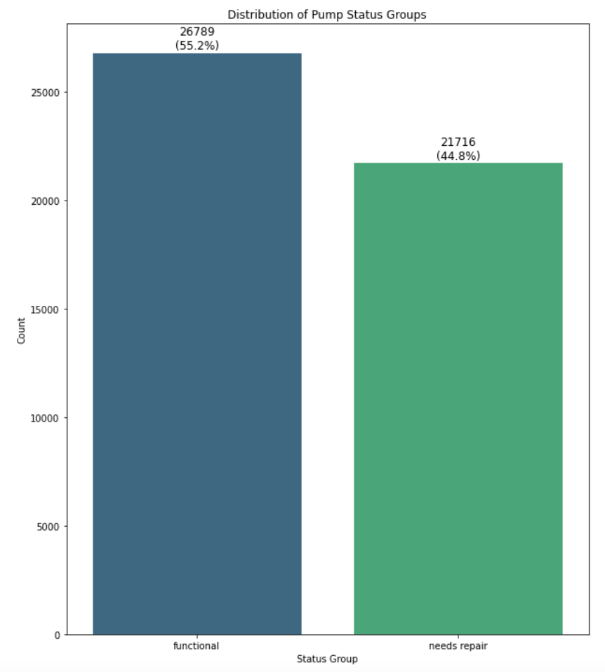
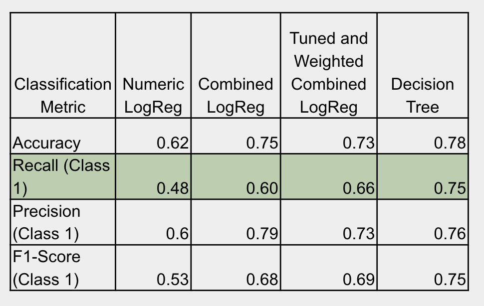
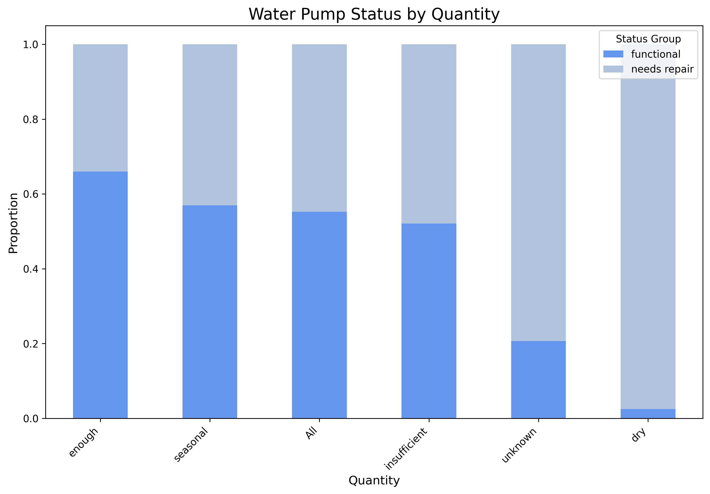
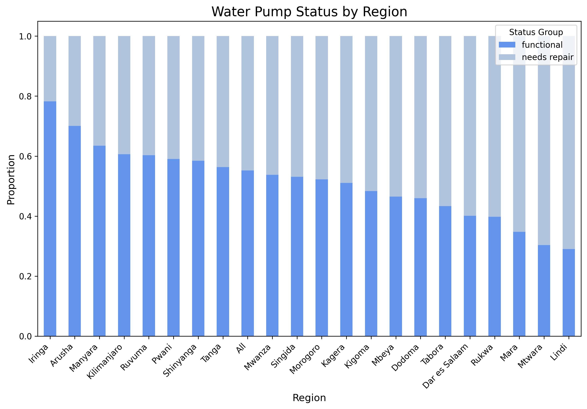

# Tanzania Water Wells Project
**Author**: [Morgan Nash](mailto:morganmichellenash@gmail.com)
\
August 2025

\
[Photo from Tanzania Rural Revival](https://tanzaniaruralrevival.org.uk/2017-visit/) 

# Overview:
This project aims to build classification models to predict the functionality of water wells in Tanzania to help Non-Government Organizations determine which wells they need to repair as well as give insite to factors that most strongly affect water pump functionality.


[Photo from Manco Capac](https://commons.wikimedia.org/wiki/File:Hand_pump-en.svg)


# Business Understanding: 
Tanzania is facing a water crisis due to many factors, some of them include climate change (droughts), higher demand for water due to increased population, and infrastructure and management issues (lack of funding for investment in proper infrastructure). Tanzania's water supply sytem has frequent water pump breakdowns which lead to frequent disruptions in water supply. Not having access to clean water means significant time and energy is spent on travelling to collect water, taking people away from work leading to subsequent socio-economic losses. Access to safe water and sanitation improves health and helps people protect themselves from illness and disease. The Government of Tanzania as well as certain Non-Government Organizations aim to mitigate the water crisis by strategically increasing investment in the maintenance and functionality of water wells across the country.
## Stakeholders:
* Non Government Organizations (NGOs) focused on helping Tanzania gain clean water access
* Government of Tanzania
# Objective: 
This project aims to:
* Gain deeper understanding of the factors that affect the functionality of a pump
* Build classification models using the features of the dataset
* Test and evaluate the models
* Address conclusions, recommendations, and limitations that the stakeholders can use
# Data Understanding: 
The data for this project comes from [Taarifa](https://taarifa.org), who compiled data from the Tanzania Ministry of Water, and was accessed through [DrivenData.org](https://www.drivendata.org/competitions/7/pump-it-up-data-mining-the-water-table/). The data contains 59,400 records of water wells, each with 41 features. Our target is status_group which contains labeling of whether a pump is functional, functional needs repair, or non functional. After cleaning the data, we'll be using the features to build a classification model to predict the status of water wells. 
Training Labels Dataset:
* id: Unique identifier for each water pump
* status_group: contains labels whether a pump is functional, functional needs repair, or non functional
Training Values Dataset:
* id: Unique identifier for each water pump
* amount_tsh: Total static head (amount of water available to pump)
* date_recorded: Date the pump data was recorded
* funder: Person or org funded the pump installation
* gps_height: Altitude of the pump location
* installer: Person or org that installed the pump
* longitude: GPS longitude coordinate of the pump location
* latitude: GPS latitude coordinate of the pump location
* wpt_name: Name of the waterpoint (if available)
* num_private: Number of private plots reserved for the waterpoint
* basin: Geographic basin of the pump location
* subvillage: Geographic location within the village
* region: Geographic location
* region_code: Coded- geographic region
* district_code: Coded- administrative district
* lga: Geographic location (Local Government Area)
* ward: Geographic location (Administrative division)
* population: Population served by the well
* public_meeting: T/F Indicator of whether there was a public meeting about the well
* recorded_by: Group entering this row of data
* scheme_management: Who operates the waterpoint
* scheme_name: Who operates the waterpoint
* permit: Indicator of whether the waterpoint is permitted
* construction_year: Year the pump was installed
* extraction_type: The kind of extraction the waterpoint uses
* extraction_type_group: The kind of extraction the waterpoint uses
* extraction_type_class: The kind of extraction the waterpoint uses
* management: Type of management for the pump
* management_group: Grouped management type
* payment: Payment type for water service
* payment_type: Type of payment
* water_quality: Quality of water provided by the pump
* quality_group - The quality of the water
* quantity - The quantity of water available to the pump
* quantity_group - The quantity of water available to the pump
* source - The source of the water
* source_type - The source of the water
* source_class - The source of the water
* waterpoint_type - The kind of waterpoint
* waterpoint_type_group - The kind of waterpoint

# Exploratory Data Analysis:
* My initial exploration of the dataset began with an analysis of our target variable, status_group. The data was originally divided into three classes: 'functional', 'functional needs repair', and 'non functional'. To simplify the classification problem and focus on identifying water pumps that need repair, I converted this into a binary classification problem by combining 'functional needs repair' and 'non functional' into a single 'needs repair' label.

* I also performed an initial analysis of the features by examining their value counts. I was able to identify inconsistencies, understand the cardinality of categorical columns, and find a significant number of missing values in certain key features, which I address prior to modeling.

## Data Preparation:
There is a high amount of redundancy among this dataset's features, as well as very high cardinality among some of the features.
The following are the categorical columns that I drop as well as the reason to drop:\
**recorded_by**: This is the same string for every entry\
**management**: I will keep management_group which contains slightly broader categories of management\
**waterpoint_type**: redundant with waterpoint_type_group\
**payment**: redundant with payment_type\
**extraction_type** & **extraction_type_group**: keeping extraction_type_class so these are not necessary\
**date_recorded**: I'm keeping construction_year so this is not necessary\
**source_class** & **source**: dropping these as I'll be keeping source_type\
**quantity_group**: redundant with quantity\
**quality_group** & **water_quality**: both have 85% of the values that are the same, lack of variance \
**wpt_name**: just a name for the waterpoint, won't help with modeling\
**subvillage**, **lga**, **ward**: can all be represented by region column\
**scheme_name**: contains too many unique values and too many nulls, keeping scheme_management\
**funder** & **installer**: both have very very high cardinality\
**basin**: too similar to region

The following are the numerical columns I drop as well as the reason to drop:\
**id**: this is just a unique identifier, will not help with modeling\
**num_private**: over 98% have the value 0\
**region_code** & **district_code**: too similar/redundant with region column\

The following are the columns kept for modeling: 
**status_group, amount_tsh, gps_height, longitude, latitude, region, population, public_meeting, scheme_management, permit, construction_year, extraction_type_class, management_group, payment_type, quantity, source_type, waterpoint_type_group**


My primary goal during the next part of data preparation was to prevent data leakage. I followed a series of careful steps to ensure my process was ethical and my model's evaluation was reliable.

First, I handled my target variable. I converted the status_group column into a binary classification problem by encoding 'functional' as 1 and 'needs repair' as 0.

With the target ready, I performed a train-test split on my entire dataset, setting aside a portion of the data for final model evaluation. This guaranteed that all subsequent preprocessing steps would be performed exclusively on the training data.

Next, I addressed missing values and outliers. I used imputation to fill in the missing gps_height, population, and construction_year data. I also handled outliers in my numerical columns to ensure they would not negatively influence my model's performance.

With the numerical data clean, I then prepared my categorical and numerical features for the model. I One-Hot-Encoded categorical columns as well as applied a Standard Scaler to normalize values in numerical columns. These transformations were applied to the training and test sets independently.

# Modeling: 
* **Recall as an Evaluation Metric:** While evaluating models with this dataset, I chose to prioritze Recall. For this specific problem, the difference in cost between False Positives and False Negatives is significant. ('functional' pumps are Class 0 and pumps that 'need repair' are Class 1.)
- False Positive: A model predicts that a water pump needs repair when it actually doesn't. That may mean that a crew member is sent out to work on a pump but finds that it actually works.
- False Negative: A a model predicts that a water pump is functional when it actually needs repair. That would mean that the pump would be left alone and unrepaired, denying communities access to water.
False Negatives have a significantly higher cost in this problem. I use Recall when evaluating my models to minimize those false negatives.

* **Logistic Regression** I began by establishing a baseline with a Dummy Classifier and then explored several Logistic Regression models. My best-performing Logistic Regression model was one that included a combination of both numerical and categorical features. After tuning hyperparameters and applying class weighting, this model produced a recall score of 0.66.

* **Decision Tree Classifier** I moved on to a Decision Tree Classifier, which was better-suited for capturing the complex, non-linear data, producing an improved recall score of 0.75.



## Relationships Between Pump Status and Features with High-Impact:






# Conclusions:
* The Decision Tree Model was a better fit for this dataset. The Decision Tree Model outperformed all of the Logistic Regression Models which shows strong evidence that the relationships between this dataset's features and the water pump status are non-linear, and the Decision Tree's ability to capture these complex interactions is what gave it a major performance advantage.

* Based on the Feature Importance Analysis using the Decision Tree Model, the geographical location and elevation of a water pump (Latitude, Longitude, and GPS Height) were the most predictive factors for its functionality.
  
* Both kinds of models made it clear that the quantity of water available to the wells has a very large impact on the pump functionality. Over 97% of water pumps that have "dry" listed as the quantity of water are in need of repair, highlighting that this is a very strong single indicator of a non-functional pump.

* Lindi and Mtwara are the regions that have the highest percent of water pumps that need repair.

* Mbeya and Kilimanjaro are the regions that have the highest number of water pumps that need repair.


## Limitations:
* **Static:** This data was recorded from 2004-2013, but is treated as a snapshot. Having access to data recorded over time could give us further insight into a specific point when a pump becomes non-functional. The actual conditions are constantlly changing. Climate change, fluctuations in water levels, rate of pump degradation, as well as current installers and maintenance crews could all be different now.
  
* **High Cardinality** of the Funder and Installer Columns. I moved forward in the data set without the funder and installer columns due to their high cardinality.

* **Missing Key Features:** This dataset is missing information about other key factors that would heavily influence water pump functionality; for example: the quality of pump parts and the frequency of pump use.

* **Missing Data and Imputation:** This dataset contains a significant amount of missing values for certain key features, which necessitated the use of imputation to handle these gaps. However, this may have introduced imputation bias, potentially affecting the model's accuracy and generalizability.


## Recommendations:
1. **Implement a Geographically-Focused Maintenance Strategy:** Create Regional Maintenance Schedules that prioritize regions with the highest amount of pumps needing repair. This focuses resources in the geographical areas that will see the greatest return on investment.

2. **Develop a Quality Control Program for Installers:** It's possible that specific installers could be associated with a higher rate of pump failures. This moves from just fixing the pumps to looking more specifically at if the pumps broke because of human error. Moving forward, installers with higher functionality rates should be selected for installing water pumps, and installers that have a low rate of functionality could either not be selected or be better trained.

3. **Explore Advanced Modeling:** Try other kinds of classification models like Random Forest or Gradient Boosting.

## Next Steps:
1. Prioritize maintenance and repairs.
   
2. Improve Data Collection:
 - Gather more recent data that has been recorded on water pumps in Tanzania.
 - Collect and record information from any maintenance or repairs in real time.

3. Switch to a proactive system by implementing a predictive model that labels pumps as high-risk before they stop working.

## For More Information

See the full analysis in the [Jupyter Notebook](notebook.ipynb) 

## Repository Structure

```
├── images
├── README.MD
├── water_wells_presentation.pdf
└── notebook.ipynb

```
